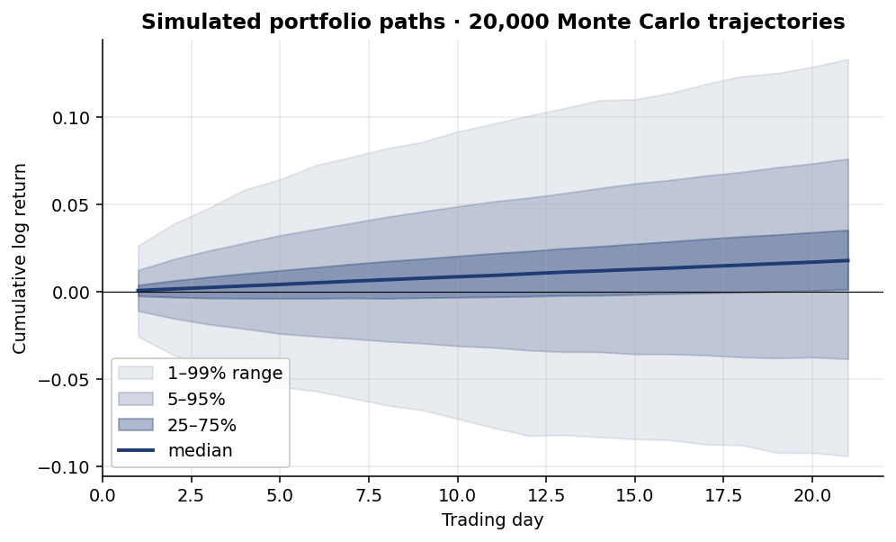
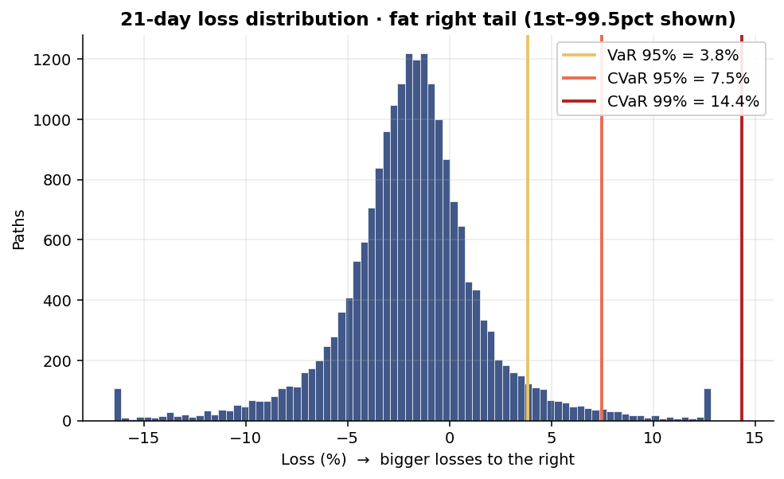
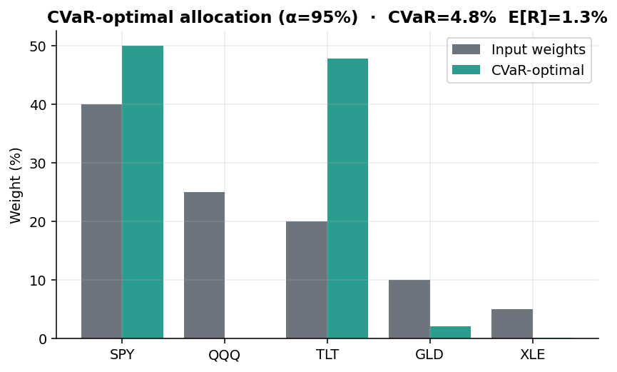
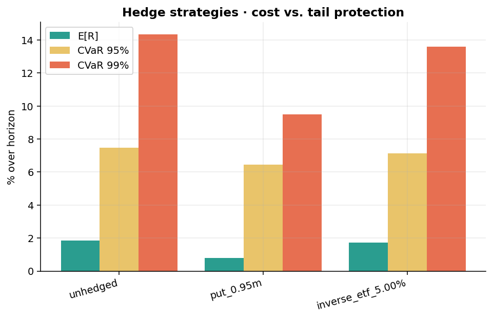
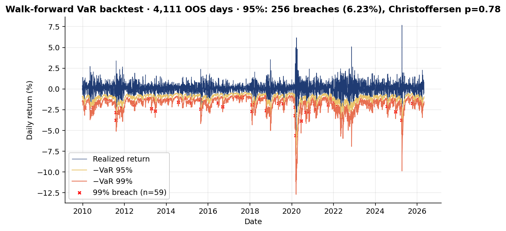

# Tail Risk Scenario Engine

> **A research-grade Monte Carlo engine for measuring, optimizing, and hedging
> the *extreme downside* of equity portfolios.**
> Fat-tailed marginals, GARCH volatility clustering, regime switching,
> tail-dependent copulas, CVaR optimization, hedge simulation, walk-forward
> backtests, and a natural-language scenario interpreter — all wired into a
> Streamlit dashboard.

<p align="center">
  
  
</p>

---

## Why this exists

Mean-variance optimization assumes returns are Gaussian and correlations are
stable. Both assumptions break exactly when they matter most — in a crisis. This
engine is a deliberate, layered answer to those failure modes:

| Failure mode of standard models      | What this engine does instead                                  |
|---|---|
| Gaussian tails → underestimates extreme losses | Student-t marginals (+ optional GPD peaks-over-threshold) |
| Constant volatility                   | Per-path GARCH(1,1)-t with explosive-path clipping             |
| One-regime world                      | 2-state Markov-switching (normal vs. crisis), fit on history   |
| Linear correlation                    | Student-t copula with **regime-conditional** dependence        |
| Mean-variance only                    | CVaR optimization (Rockafellar–Uryasev LP via cvxpy)           |
| "Trust the model" without validation  | Walk-forward backtest with Kupiec & Christoffersen tests       |

---

## Highlights

### 1 · Fat-tailed Monte Carlo with regime switching
20,000 paths over a 21-day horizon, fit on 18 years of SPY/QQQ/TLT/GLD/XLE
daily data. Tail thickness (CVaR 99% ≈ 14%) is driven by the t-copula plus
crisis-state vol scaling — a vanilla normal-copula model gives ~8%.

<p align="center">
  
</p>

### 2 · CVaR-optimal portfolios shift toward genuine diversifiers
Given the same fitted model, the CVaR optimizer moves weight out of equity-beta
and into Treasuries — a sensible response to fat tails that mean-variance
under-emphasizes.

<p align="center">
  
</p>

### 3 · Hedge strategies are scored on cost vs. tail protection
Every hedge variant is run through the same simulated paths so trade-offs are
honest: protective puts roughly halve the *deep* tail at a real expected-return
cost; inverse-ETF allocations move the median much less but leave 99% CVaR
nearly untouched.

<p align="center">
  
</p>

### 4 · Walk-forward backtest with regulatory coverage tests
Refits a portfolio-level GARCH(1,1)-t every 63 days on an expanding window,
forecasts 1-day VaR analytically, and scores breaches against the
**Kupiec POF** test (unconditional coverage) and **Christoffersen** test
(independence). On 4,111 OOS days:

|                | breach rate | nominal | Kupiec p | Christoffersen p |
|----------------|-------------|---------|----------|------------------|
| 95% VaR        | 6.23%       | 5.00%   | 0.000    | **0.78** ✓        |
| 99% VaR        | 1.43%       | 1.00%   | 0.008    | **0.28** ✓        |

The model captures volatility *dynamics* well (Christoffersen passes — no breach
clustering) but tails are slightly thinner than reality (Kupiec rejects). That
is exactly the kind of diagnostic this layer is designed to produce.

<p align="center">
  
</p>

### 5 · Natural-language scenario queries
The dashboard accepts plain English and routes it through a small interpreter
into the simulation engine:

> *"What is my loss if 2008 repeats?"* → historical replay, **CVaR 95% = 23.5%**
> *"What if tech crashes 20%?"*       → asset shock on QQQ, **CVaR 95% = 21.6%**
> *"What if volatility doubles?"*     → vol multiplier 2×, **CVaR 95% = 35.0%**

---

## Architecture

```
src/tailrisk/
├── data/          Yahoo Finance loader + log-return computation
├── models/        Distributions (t, GPD), GARCH, regime, copula — each isolated
├── simulation/    MonteCarloEngine composes the fitted models into paths
├── risk/          VaR, CVaR, drawdown, attribution
├── optimization/  CVaR LP optimizer (Rockafellar–Uryasev)
├── hedging/       Put / inverse-ETF payoff models + comparison
├── stress/        Named historical scenarios + parametric shocks
├── backtest/      Walk-forward GARCH + Kupiec & Christoffersen tests
├── viz/           Plotly figures (fan chart, loss dist, hedge, backtest)
├── llm/           NL → ScenarioRequest interpreter
└── cli.py         `tailrisk` CLI (typer)
app/streamlit_app.py    Interactive dashboard
configs/                Default + stress-scenario YAMLs
tests/                  15-test pytest suite
```

The design intent is **composability over monolith**: each statistical concern
is its own module with a `Fit` dataclass, and `fit_models()` snaps them
together. Swapping the t-copula for a vine copula, or adding a third regime,
touches one file.

---

## Quickstart

```powershell
python -m venv .venv
.\.venv\Scripts\Activate.ps1
pip install -e ".[app,dev]"

# CLI
tailrisk simulate --config configs/default.yaml
tailrisk optimize --config configs/default.yaml
tailrisk hedge    --config configs/default.yaml
tailrisk backtest --config configs/default.yaml --min-train 750

# Dashboard
streamlit run app/streamlit_app.py

# Regenerate the README figures
python scripts/generate_readme_figures.py
```

---

## Engineering notes

A few choices worth flagging for anyone reading the code:

- **Per-path GARCH state.** `(h_prev, eps_prev)` are tracked per path with
  shape `(n_paths, n_assets)`, so each trajectory gets its own conditional
  volatility evolution — without this, tail spread is dramatically under-stated.
  Innovations are clipped at a configurable z-score to prevent the rare
  α + β ≈ 0.99 + heavy-tailed shock combo from exploding numerically.
- **Regime-conditional copula.** Historical days are classified by the
  smoothed regime probabilities; if both regimes have enough observations a
  separate copula is fit per regime. At simulation time, the path's current
  regime selects which copula draws the dependence shock.
- **Mean is added once.** Student-t marginals carry their own location
  parameter, so the engine subtracts `loc` before applying GARCH-scaled shocks
  to avoid double-counting drift — a subtle bug that quadrupled expected
  returns in an earlier draft.
- **Backtest uses portfolio-level GARCH** (not per-asset + copula at every
  step). For *coverage* validation this is the standard academic protocol and
  it makes the walk-forward tractable.
- **`statsmodels` quirk.** Markov regression returns a column-stochastic
  transition matrix — the engine transposes and renormalizes so each row sums
  to 1.

---

## Roadmap

- [ ] Vine copulas for higher-dimensional tail dependence
- [ ] Real LLM backend behind the NL interpreter (currently a typed-pattern stub)
- [ ] On-disk cache for `yfinance` so runs are reproducible offline
- [ ] Expected Shortfall backtest (Acerbi–Székely Z-tests)
- [ ] Multi-day VaR backtest (currently 1-day only)

---

## References

- Rockafellar & Uryasev (2000), *Optimization of Conditional Value-at-Risk*.
- McNeil, Frey & Embrechts, *Quantitative Risk Management* (Princeton, 2015).
- Hamilton (1989), *A New Approach to the Economic Analysis of Nonstationary
  Time Series and the Business Cycle*, Econometrica.
- Engle (1982), Bollerslev (1986) on (G)ARCH.
- Christoffersen (1998), *Evaluating Interval Forecasts*, IER.
- Kupiec (1995), *Techniques for Verifying the Accuracy of Risk Measurement
  Models*.

---

*Built as a portfolio piece on quantitative risk modeling — equal parts
statistics, software architecture, and honest validation.*
